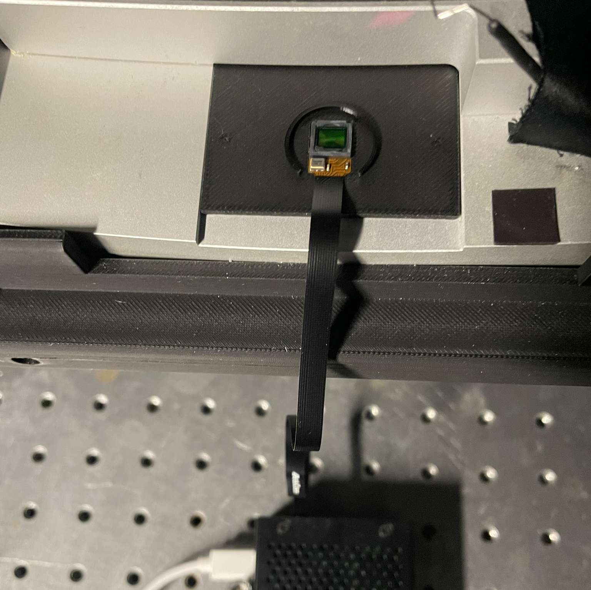
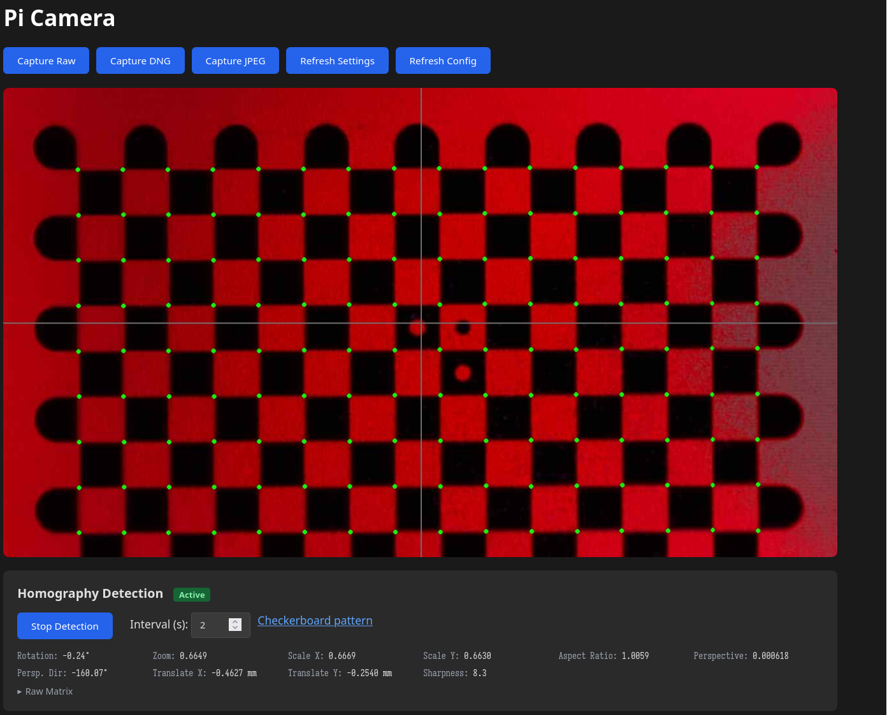

A web application run on a Raspberry Pi that uses a camera to calibrate and checkpoint a light path.

<figure>
  
  
  <figcaption>Camera setup and corresponding web interface.</figcaption>
</figure>

[Homography demo video](docs/assets/homography-demo.mp4)

Features include:

    - live stream 
    - raw, DNG or jpeg capture
    - homography preview (when viewing a checkerboard)
    - web view and capture API

# Project organization
The Flash web server is in `flaskserver`, with `flaskserver/app.py` being the entrypoint. `flaskserver/camera.py` and `flaskserver/cv.py` are modules used by the web server for interacting with the camera and calculating homographies. There are some design notes in [docs/web-design.rst](docs/web-design.rst).

# Setup 
The project relies on the [Picamera2](https://pypi.org/project/picamera2/) Python package. The package documentation recommends installing it using `apt`:

    sudo apt install python3-picamera2 --no-install-recommends

The other requirements for the project are listed in `requirements.txt`. If you are using a virtual environment, create it with access to the system packages so that it can have access to picamera2. For example:

    python -m venv --system-site-packages venv
    source venv/bin/activate
    pip install -r requirements.txt

## Run
From the `flaskserver` directory:

    python ./flaskserver/app.py

## Install web server as service
To make the Raspberry Pi start the web server on boot, a service must be registered. `scripts/copy_service_config.sh` shows an example of how this can be done, copying `config/lightpath-camera.service` to `/etc/systemd/system`, with that service file instructing `scripts/service.sh` to be run on startup.

